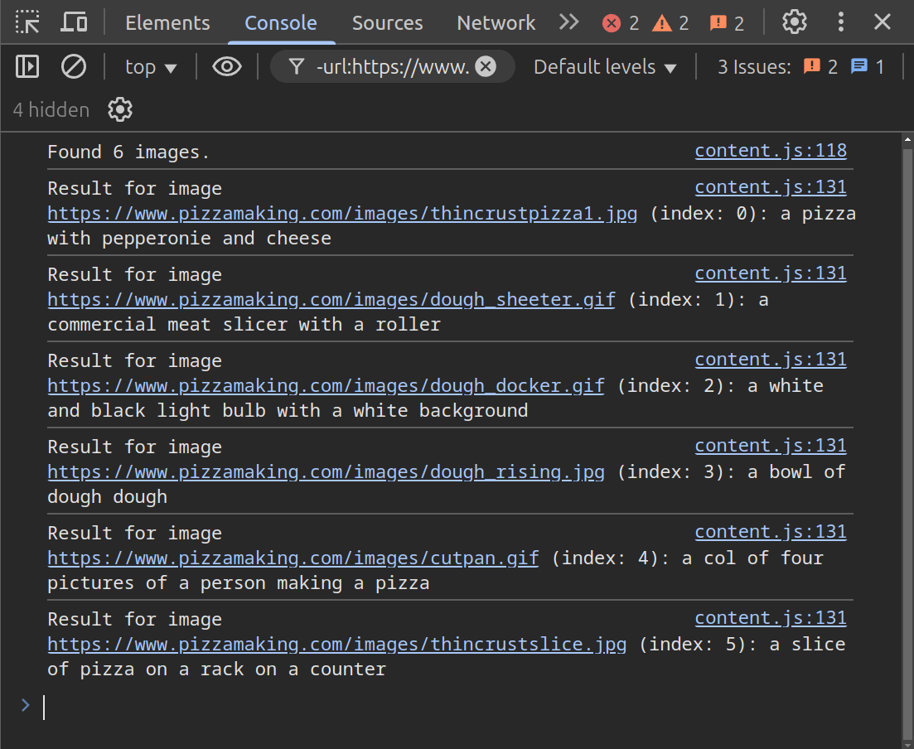

    <b style="font-size: 1.3rem">Português</b> | <a style="font-size: 1.3rem" href="README-en.md">English</a>

# descrito
**descrito** é uma extensão de navegador que automaticamente gera legendas para imagens contidas em páginas da *web*.

## Como funciona

### Configuração
#### *Popup*

    

1. As legendas são adicionadas via atributo `alt` ou tag `figcaption`.
2. Se configurado para **"Apenas imagens sem legenda"**, a extensão verificará se a imagem já possui uma legenda (via alt, figcaption ou aria-label). Caso não encontre uma legenda, enviará a imagem para o modelo IA.
3. Se configurado para **"Todas as imagens"**, enviará todas as imagens para geração de legendas, independentemente de já possuírem uma.

### Geração de legendas

Para gerar as legendas, a extensão utiliza um *Space* do [Hugging Face](https://huggingface.co) como *endpoint* *API* via [Gradio Client](https://www.npmjs.com/package/@gradio/client). A imagem é enviada como entrada e o modelo de IA gera uma legenda correspondente.

Modelo IA: [BLIP](https://huggingface.co/Salesforce/blip-image-captioning-base)

Hugging Face Space: [figdavi/descrito](https://huggingface.co/spaces/figdavi/descrito)

## Exemplo

#### Antes da geração de legendas

#### Depois da geração de legendas (opção de legenda visível)

#### Console

## Instalação (Chrome)
### Usuário
1. Baixe o arquivo `descrito.crx` no [último lançamento](https://github.com/figdavi/descrito/releases/latest)
2. Acesse [chrome://extensions/](chrome://extensions/)
3. Arraste e solte o arquivo baixado
4. Selecione "Adicionar extensão"

### Modo desenvolvedor
1. Clone o repositório
2. Acesse [chrome://extensions/](chrome://extensions/)
3. Ative o "Modo desenvolvedor" no canto superior direito
4. Clique no botão "Carregar sem compactação" e selecione a pasta `descrito/`

## Licença
Este projeto é licenciado sob a Apache License 2.0, disponível no arquivo [LICENSE](LICENSE).

O projeto inclui código do [Gradio](https://www.npmjs.com/package/@gradio/client?activeTab=code), especificamente o arquivo `index.min.js`, originalmente licenciado sob Apache 2.0.  
Pequenas modificações (como a remoção de *exports*) foram feitas.  
Veja [LICENSE](LICENSE) para mais detalhes.