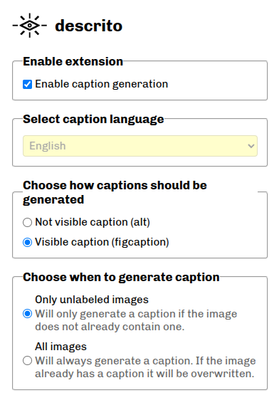
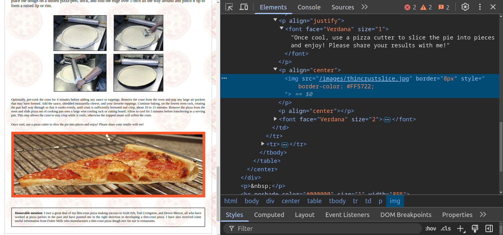
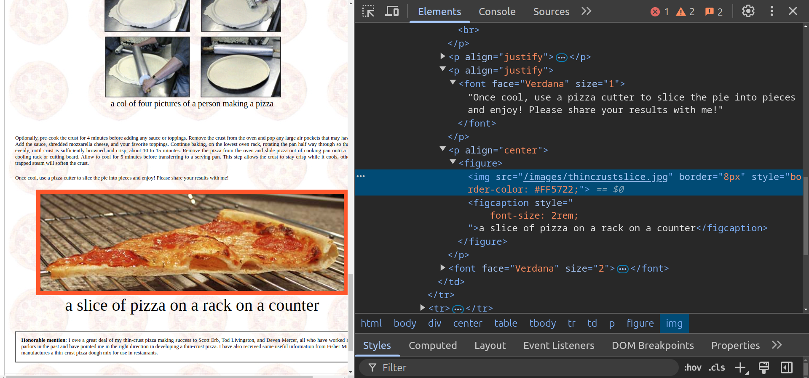
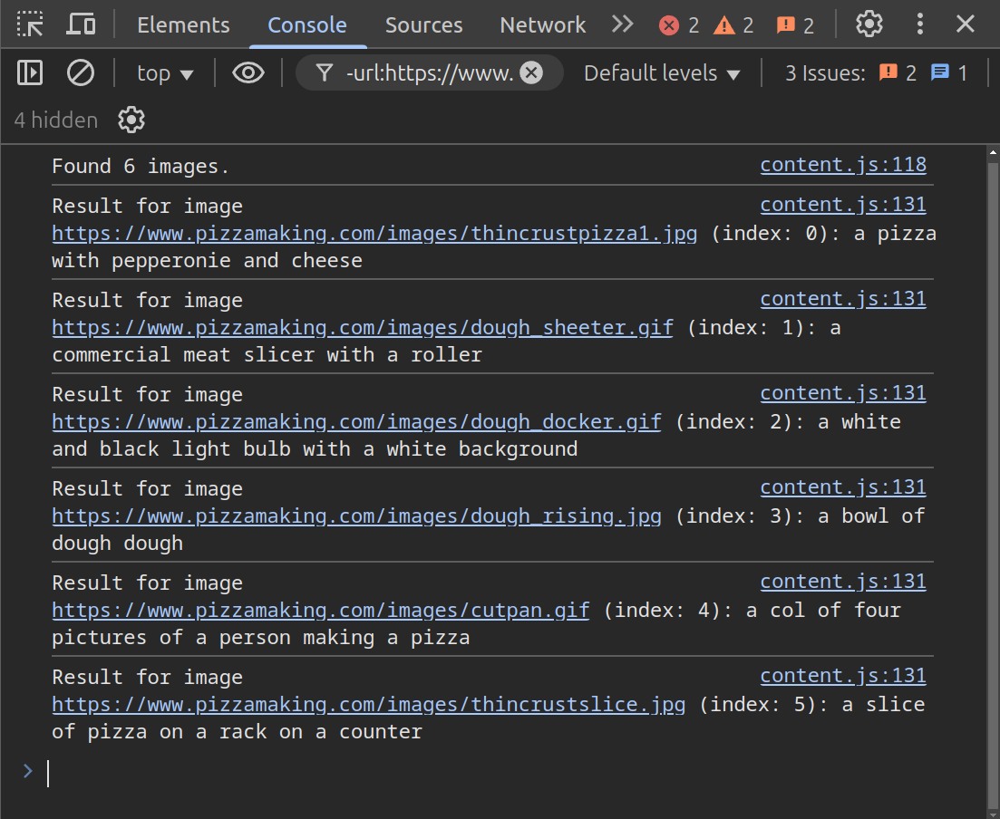

README: [Português](README.md) | <b>English</b>

# descrito
**descrito** is browser extension that automatically generate captions for images contained in web pages.

## How it works

### Configuration
#### Popup

    

1. Captions are added either via the `alt` attribute or a `figcaption` tag.
2. If set to **"Only unlabeled images"**, the extension will check if the image already has a caption (via alt, figcaption, or aria-label). If no caption is found, it sends the image to the AI model.
3. If set to **"All images"**, it sends every image for caption generation regardless of whether it has an existing caption.

### Caption Generation

For the caption generation, the extension uses a [Hugging Face](https://huggingface.co) Space as an API endpoint via [Gradio Client](https://www.npmjs.com/package/@gradio/client). It sends the image as input and the AI model retrieves a caption for the image.

AI model: [BLIP](https://huggingface.co/Salesforce/blip-image-captioning-base)

Hugging Face Space: [figdavi/descrito](https://huggingface.co/spaces/figdavi/descrito)

## Example

#### Before caption generation

#### After caption generation (visible caption option)

#### Console

## Installation (Chrome)
### User mode
1. Download the file: [descrito.crx](descrito.crx)
1. Go to [chrome://extensions/](chrome://extensions/)
2. Drag and drop the downloaded file
3. Select "Add extension"

### Developer mode
1. Clone the repository
2. Go to [chrome://extensions/](chrome://extensions/)
3. Activate "Developer mode" on top right corner
4. Click on "Load unpacked" button and select the `descrito/` folder

## License
This project is licensed under the Apache License 2.0 found in the [LICENSE](LICENSE) file.

It includes code from [gradio](https://www.npmjs.com/package/@gradio/client?activeTab=code), specifically `index.min.js` file, originally licensed under Apache 2.0.  
Minor modifications (such as removing export statements) were made to allow bundling.  
See [LICENSE](LICENSE) for details.